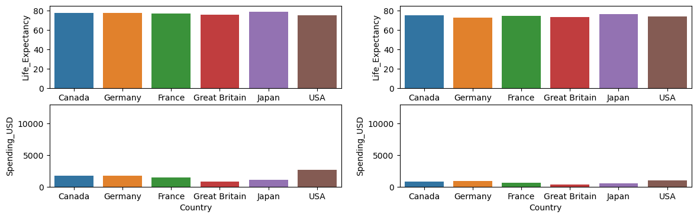
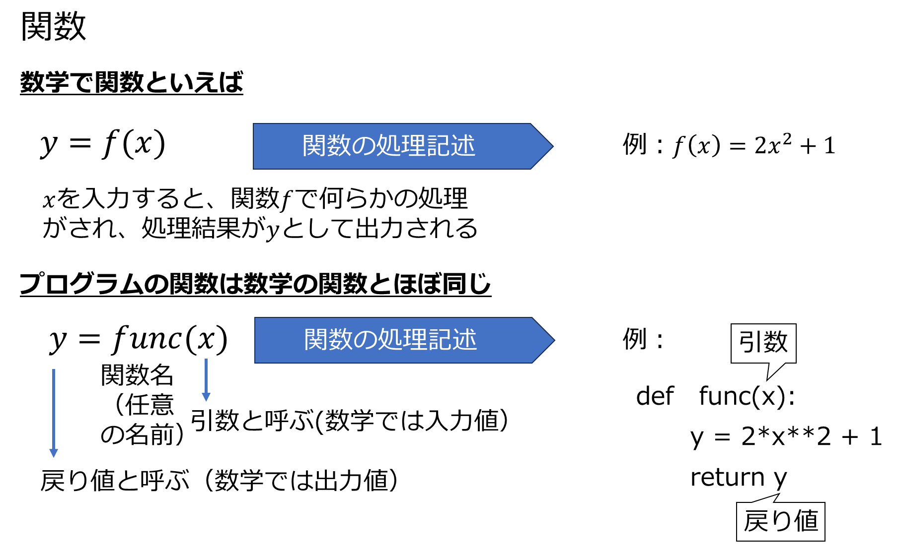
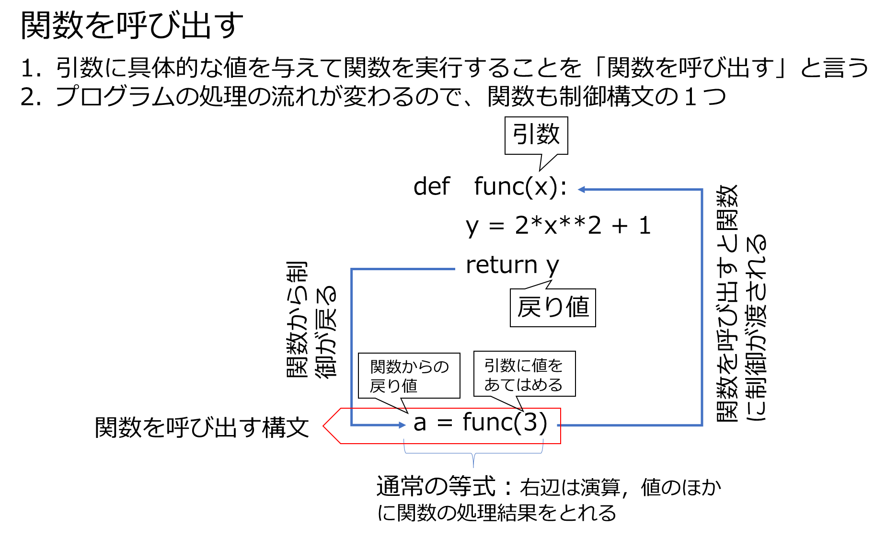
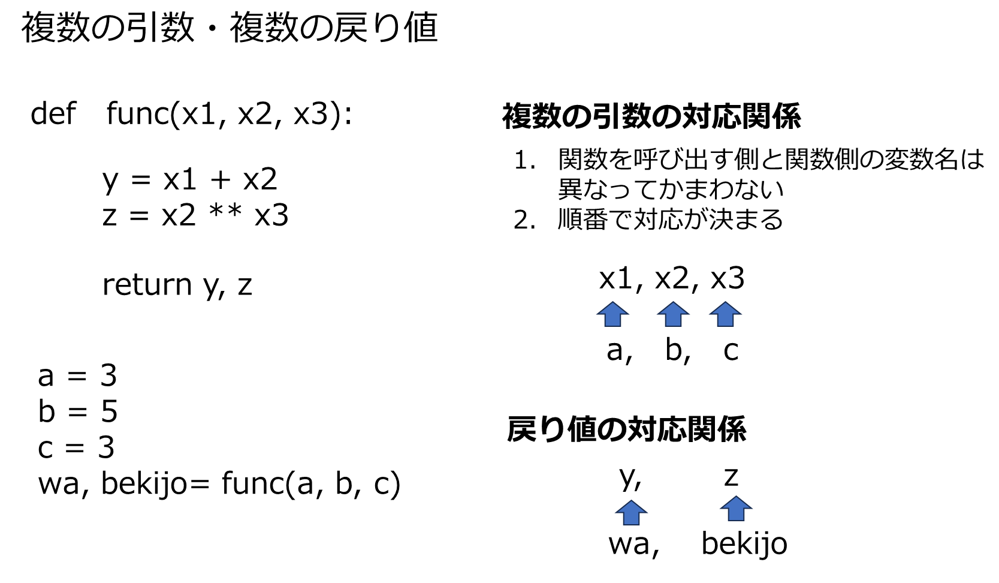
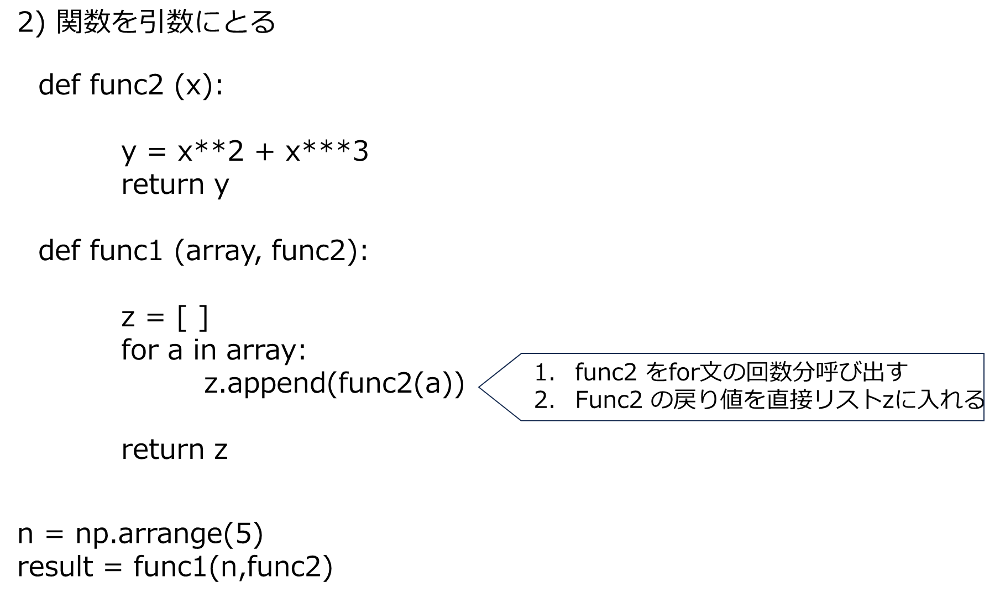

# 関数

- 同じような処理を繰り返す時、何度も同じプログラムを書かずに再利用する
- 非常に長いプログラムを読みやすくする
- 複雑な処理でも入出力さえわかれば使うことができる

### 平均寿命と医療支出のデータセット


```python
import seaborn as sns

lifespan = sns.load_dataset("healthexp")
lifespan

```


<div>
<style scoped>
    .dataframe tbody tr th:only-of-type {
        vertical-align: middle;
    }

    .dataframe tbody tr th {
        vertical-align: top;
    }

    .dataframe thead th {
        text-align: right;
    }
</style>
<table border="1" class="dataframe">
  <thead>
    <tr style="text-align: right;">
      <th></th>
      <th>Year</th>
      <th>Country</th>
      <th>Spending_USD</th>
      <th>Life_Expectancy</th>
    </tr>
  </thead>
  <tbody>
    <tr>
      <th>0</th>
      <td>1970</td>
      <td>Germany</td>
      <td>252.311</td>
      <td>70.6</td>
    </tr>
    <tr>
      <th>1</th>
      <td>1970</td>
      <td>France</td>
      <td>192.143</td>
      <td>72.2</td>
    </tr>
    <tr>
      <th>2</th>
      <td>1970</td>
      <td>Great Britain</td>
      <td>123.993</td>
      <td>71.9</td>
    </tr>
    <tr>
      <th>3</th>
      <td>1970</td>
      <td>Japan</td>
      <td>150.437</td>
      <td>72.0</td>
    </tr>
    <tr>
      <th>4</th>
      <td>1970</td>
      <td>USA</td>
      <td>326.961</td>
      <td>70.9</td>
    </tr>
    <tr>
      <th>...</th>
      <td>...</td>
      <td>...</td>
      <td>...</td>
      <td>...</td>
    </tr>
    <tr>
      <th>269</th>
      <td>2020</td>
      <td>Germany</td>
      <td>6938.983</td>
      <td>81.1</td>
    </tr>
    <tr>
      <th>270</th>
      <td>2020</td>
      <td>France</td>
      <td>5468.418</td>
      <td>82.3</td>
    </tr>
    <tr>
      <th>271</th>
      <td>2020</td>
      <td>Great Britain</td>
      <td>5018.700</td>
      <td>80.4</td>
    </tr>
    <tr>
      <th>272</th>
      <td>2020</td>
      <td>Japan</td>
      <td>4665.641</td>
      <td>84.7</td>
    </tr>
    <tr>
      <th>273</th>
      <td>2020</td>
      <td>USA</td>
      <td>11859.179</td>
      <td>77.0</td>
    </tr>
  </tbody>
</table>
<p>274 rows × 4 columns</p>
</div>


### 複数の区画にグラフ表示する
1.上段は平均寿命、下段は医療支出費を表示する  
2. 左列は、1980年　右列は、2020年


```python
import matplotlib.pyplot as plt

fig,ax = plt.subplots(2,2,figsize=(14,4))
lifespan_2020 = lifespan[lifespan['Year']==2020]
lifespan_1970 = lifespan[lifespan['Year']==1980]
sns.barplot( x = "Country", y = "Life_Expectancy",data=lifespan_1970,ax=ax[0,0])
sns.barplot( x = "Country", y = "Life_Expectancy",data=lifespan_2020,ax=ax[0,1])
sns.barplot( x = "Country", y = "Spending_USD",data=lifespan_1970,ax=ax[1,0])
sns.barplot( x = "Country", y = "Spending_USD",data=lifespan_2020,ax=ax[1,1])
ax[0,0].set_ylim(0, 85)
ax[0,1].set_ylim(0, 85) #縦軸のスケールをそろえる
ax[1,0].set_ylim(0, 13000)
ax[1,1].set_ylim(0, 13000) #縦軸のスケールをそろえる
plt.show()
```


    

    


**上記のグラフについて、対象年をいろいろ変えて比較してみたい。その都度上記のプログラムを書くのは大変！**  
**以下のように書くと、compare_graph(1980,1990)内に任意の2つの年を入力するだけで実現できる**


```python
import matplotlib.pyplot as plt

def compare_graph(year_right, year_left):
    fig,ax = plt.subplots(2,2,figsize=(14,4))
    lifespan_right = lifespan[lifespan['Year']==year_right]
    lifespan_left = lifespan[lifespan['Year']==year_left]
    sns.barplot( x = "Country", y = "Life_Expectancy",data=lifespan_left,ax=ax[0,0])
    sns.barplot( x = "Country", y = "Life_Expectancy",data=lifespan_right,ax=ax[0,1])
    sns.barplot( x = "Country", y = "Spending_USD",data=lifespan_left,ax=ax[1,0])
    sns.barplot( x = "Country", y = "Spending_USD",data=lifespan_right,ax=ax[1,1])
    ax[0,0].set_ylim(0, 85)
    ax[0,1].set_ylim(0, 85) #縦軸のスケールをそろえる
    ax[1,0].set_ylim(0, 13000)
    ax[1,1].set_ylim(0, 13000) #縦軸のスケールをそろえる
    plt.show()

compare_graph(1980,1990)
```


    

    


# 1. 関数の基本





**例1 入力値が奇数か偶数かを判定し、判定結果を返す関数**


```python
def odd_even(x):
    if x%2==0:
        y='偶数'
    else:
        y='奇数'
    return y
num = 5
result = odd_even(num)
result
```


    '奇数'


**例2. 入力値の平方根、2乗の値を返す関数**


```python
def sq(x):
    y = x**(1/2)
    z = x**2
    return y,z
val=5
sq_root, sq = sq(val)
print(sq_root,sq)
```

    2.23606797749979 25
    

**例3. 指定した文字の出現回数を求める関数**


```python
def count_char(sentence, character):
    counter=0
    for s in sentence:
        if character == s:
            counter+=1
    return counter

c = count_char('すもももももももものうち','も')
c
```


    8





```python
def   func(x1, x2, x3):
    
    y = x1 + x2
    z = x2 ** x3
    return y,z


a = 3
b = 5
c = 3
wa, bekijo= func(a, b, c)
print(wa, bekijo)
```

    8 125
    

# 2. 様々な関数 


### 演習　以下を平均を計算するように修正せよ


```python
import numpy as np
def  func_array (a, calc):

	if calc == 'sum':
		result = np.sum(a)
	elif calc == 'mean':
		result = np.mean(a)
	else:
		result = np.max(a)

	return result
calc = "sum"
array = np.random.randint(0,10,20)
print(array)
z = func_array(array, calc)
print(z)
```

    [9 3 5 4 9 6 3 3 3 6 6 0 0 0 9 8 7 7 5 3]
    96
    




```python
def func2 (x):

	y = x**2 + x**3
	return y

def func1 (array, func2):

	z = [ ]
	for a in array:
		z.append(func2(a))

	return z

n = np.arange(5)
print(n)
result = func1(n,func2)
print(result)
```

    [0 1 2 3 4]
    [0, 2, 12, 36, 80]
    

# 演習1.
1. 以下のようなリストを引数に渡すと、要素をすべて足した値を返す関数をかけ


```python
a = [2,6,2,6,10]

```


    26


2. 関数$g$は、リストを引数にとり、その要素をすべて二乗したリストを返す関数である。また、関数$f$は、引数として渡したリストの要素の合計値を出力する関数である。
$f$の引数に以下のリストa,および関数$g$を渡すようにして、aの二乗和を戻すようにコーディングを完成させよ


```python
def g(a):
   


def f(g,x):
   

a = [2,6,2,6,10]
y = f(g,a)
print(y)
```

    52
    

3. 今日は晴れ　→　れ晴は日今　のように文列を逆にして出力する関数を書け


```python


moji = reverse_char('今日の天気は晴れ')
moji
```


    'れ晴は気天の日今'


4. 関数を繰り返し呼び出す
   以下のfor文中からiの2乗を計算する関数を呼び出し、戻り値を要素とするリスト型を作るようにコードを完成させよ


```python
def power (num):
    

num_list=[]
for i in range(10):
    
print(num_list)
```

    [0, 1, 4, 9, 16, 25, 36, 49, 64, 81]
    

# 3. ブラックボックスと関数 
1, 関数はブラックボックス（処理の中身がわかってない）のままで使うことができる  
2. 何を入力したら何が出力されるかだけわかっていればよい

**例 文書を自動的に単語分割する**  
- def tokenize()は難解なプログラムだが、入力（引数）に、文書と抽出したい品詞をとると、分割した単語と品詞が出力されることはわかる。
- 中身がわかっていなくても、入出力がわかれば、この関数はいろいろな場面で使うことができる。関数中身がわかってなくても、使いまわせる。


```python
!pip install janome
```


```python
from janome.tokenizer import Tokenizer
def get_token(sentence, hinsi):
    t = Tokenizer()
    words=[]
    for token in t.tokenize(sentence):
    	hinshi = token.part_of_speech.split(',')
    	if hinshi[0] == hinsi :
            words.append(token.surface)
    return words

words = get_token('すもももももももものうち','名詞')
print(words)
```

    ['すもも', 'もも', 'もも', 'うち']
    

# 演習2.
以下の関数は何を入力し、何を出力する関数か。いろいろな文字列を入力して推測せよ。


```python
import unicodedata
import re

def normalize_jpn(text):
    
    normalized = unicodedata.normalize('NFKC', text)
    normalized = normalized.lower()
    char = re.findall('[a-zA-Z一-龥ぁ-んァ-ンー々。、]+', normalized)
    sentence =''.join(char)
    return sentence

sentence = normalize_jpn("身長:１８０cm サイズ：L")
sentence
```


    '身長cmサイズl'


# 4.　関数の外部モジュール化   
1. 関数を外部モジュールにする  
   (.pyを修正した場合は、カーネルをリセットして再実行すること)
3. 外部モジュール化すると関数はブラックボックス化して、プログラムがシンプルに読みやすくなる

### 構文

---

```python
import 外部モジュール名

戻り値 = 外部モジュール名.関数名(引数)

```

---


 解説2 の単語分割の関数を.pyファイル（外部ファイル）にして、importで読み込む  
 split_words.pyの中身をみること
 


```python
import split_words

words = split_words.get_token('すもももももももものうち','名詞')
words
```


    ['すもも', 'もも', 'もも', 'うち']


# 演習3
演習2.のプログラムの関数 normalize_jpn を外部モジュール regular.py に書いた。これを解説3と同様に読み込んで演習②と同じ処理ができるようにコードをかけ


```python

```


    '身長cmサイズl'


```python

```
